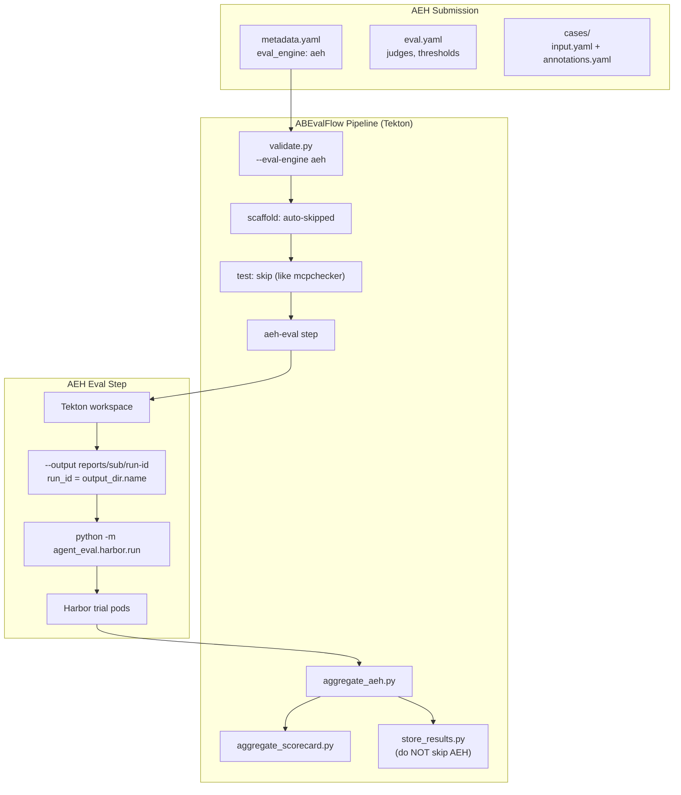

# AEH Engine Integration Plan

## JIRA Ticket and Branch

**Ticket**: [APPENG-5300](https://redhat.atlassian.net/browse/APPENG-5300) — "Agent-eval-harness: local POC to pipeline integration"
- Parent: APPENG-4901 (AB Eval Flow)
- Status: New

**Branch**: `APPENG-5300/aeh-engine-integration`

```bash
git checkout -b APPENG-5300/aeh-engine-integration
```

---

## Suggested Sequencing

**Ship thin vertical slice first** (MVP — Flow A only):
1. Schema → Validate → Single-run K8s evaluate → `aggregate_aeh.py` → Sample submission → Docs

**Defer to follow-up** (Flow A/B — design locked below, implementation later):
- Two Harbor runs + distinct `score.py pairwise` Tekton step
- Baseline restore from MinIO/DB when arms span PipelineRuns
- MLflow overrides
- ObservabilityMetrics wiring (blocked on PR #48)

---

## References

### Agent-Eval-Harness Core

| Module | Path | Purpose |
|--------|------|---------|
| Harbor Run | `agent_eval/harbor/run.py` | Single-run orchestrator (no `--baseline`) |
| Task Generator | `agent_eval/harbor/tasks.py` | Generates task packages from eval.yaml |
| Reward Bridge | `agent_eval/harbor/reward.py` | Per-case judges (skips pairwise) |
| Pairwise scorer | `skills/eval-run/scripts/score.py` | Suite-level `pairwise` subcommand |
| K8s Environment | `agent_eval/harbor/kubernetes.py` | OpenShift-compatible pod execution |
| Config | `agent_eval/config.py` | EvalConfig — no mode/baseline YAML fields |

### ABEvalFlow Integration Points

| File | Changes Needed |
|------|----------------|
| `abevalflow/schemas.py` | Add `AEH = "aeh"` to EvalEngine |
| `abevalflow/engines/aeh.py` | New engine adapter |
| `scripts/validate.py` | Add `run_aeh` flag and validation |
| `pipeline/tasks/phases/evaluate.yaml` | Add AEH step |
| `pipeline/tasks/phases/test.yaml` | Add AEH to skip list |

---

## Architecture (Workspace-based, K8s Only — MVP Flow A)



**Key simplification**: No ConfigMap for MVP. Orchestrator reads `eval.yaml` / `cases/` from the workspace. Results land under a namespaced run dir so `run_id` is meaningful.

---

## Phase 1: Schema and Engine Registration

### 1.1 Add AEH to EvalEngine enum

File: `abevalflow/schemas.py`

```python
class EvalEngine(StrEnum):
    HARBOR = "harbor"
    ASE = "ase"
    MCPCHECKER = "mcpchecker"
    A2A = "a2a"
    AEH = "aeh"  # NEW
    BOTH = "both"  # Harbor + ASE only
```

### 1.2 Create AEH engine adapter

New file: `abevalflow/engines/aeh.py`

**Single-run mode** (MVP):
- `read_result()`: Load `report.json` produced by `aggregate_aeh.py` (preferred), or fall back to `summary.yaml` + `run_result.json`
- `to_gate_result()`: Map `mean_reward` / judge means to GateResult vs threshold

**Pairwise mode** (deferred — after `score.py pairwise` has run):
- `read_result()`: Load unified `report.json` that includes `pairwise` (and both arms if present)
- `to_gate_result()`: Gate on `wins_a` / win rate (document mapping; do **not** invent Harbor-style `uplift` unless explicitly mapped from `wins_a/(wins_a+wins_b)`)

**Mode detection**: Prefer `report.json.mode` (`single` | `pairwise`). Fallback: `summary.yaml` contains `pairwise` key (written by `score.py pairwise` into the **treatment** run's summary).

### 1.3 Register engine

File: `abevalflow/engines/__init__.py`

```python
from abevalflow.engines.aeh import AEHEngine
```

---

## Phase 2: Validation

### 2.1 Add AEH validation

File: `scripts/validate.py`

```python
run_aeh = eval_engine == EvalEngine.AEH

if run_aeh:
    errors.extend(_check_aeh_structure(submission_dir))
```

### 2.2 AEH structure checks

Required:
- `eval.yaml` (main config with judges)
- `cases/` directory with at least one case
- Each case: `input.yaml` (required), `annotations.yaml` (optional)

**Skip** (not applicable to AEH):
- `skills/SKILL.md` (skill submission only)
- `tests/test_outputs.py` (Harbor only)
- `instruction.md` (Harbor only)

**Pairwise-capable submissions** (deferred validation when `aeh-baseline-run-id` is set or `aeh-mode=pairwise`):
- Require a judge named `pairwise` in `eval.yaml` (or document that builtin comparison prompt is used)
- Ideally require `thresholds.pairwise`

---

## Phase 3: Pipeline Phase Guards

AEH needs explicit skip/guard behavior in phases that assume skill structure.

### 3.1 Scaffold (evaluate.yaml) — NO CHANGE NEEDED

The `harbor-scaffold` step in `evaluate.yaml:184-188` already guards on engine name:
```yaml
if [ "$EVAL_ENGINE" != "harbor" ] && [ "$EVAL_ENGINE" != "both" ]; then
  echo "Skipping scaffold (eval-engine=$EVAL_ENGINE)"
  exit 0
fi
```
AEH is automatically skipped. **No new code required.**

### 3.2 Test phase (`test.yaml`)

Use the same short-circuit pattern as `mcpchecker` (exits entire test phase early in `setup` step):

```yaml
# In setup step, add aeh to the skip list
if [ "$EVAL_ENGINE" = "mcpchecker" ] || [ "$EVAL_ENGINE" = "aeh" ]; then
  echo "Skipping test phase for eval-engine=$EVAL_ENGINE"
  exit 0
fi
```

This skips all test steps (skillmd-scan, quality-review, etc.) rather than guarding each individually.

### 3.3 Gates and Certification

**Which gates apply for `eval_engine: aeh`**:

| Gate | Applies? | Reason |
|------|----------|--------|
| validation | YES | Structure check |
| quality-review | NO | No SKILL.md to review |
| skillmd-scanner | NO | No SKILL.md |
| cisco-scanner | **NO (MVP)** | Skip for AEH; no skill Python to scan |
| aeh-eval | YES | Core evaluation |

**MVP decision**: Skip cisco-scanner for AEH. AEH submissions contain `eval.yaml` + `cases/`, not skill Python code.

**Certification profile**: AEH submissions likely need a new profile or use `agent` profile with adapted checks. Trusted/Certified checks that assume SKILL.md should be marked N/A.

---

## Phase 4: Evaluate Task

### 4.1 Add AEH params

Files: `ci-pipeline.yaml` AND `ci-pipeline-dev.yaml`

```yaml
params:
  # Model overrides (empty = use eval.yaml)
  - name: aeh-model-override
    type: string
    default: ""
    description: "Override models.skill from eval.yaml"
  - name: aeh-judge-model-override
    type: string
    default: ""
    description: "Override models.judge from eval.yaml"
  # Mode is pipeline-decided — eval.yaml has no mode field
  - name: aeh-baseline-run-id
    type: string
    default: ""
    description: "Prior run ID for pairwise (deferred). Empty = single-run mode"
```

### 4.2 Add AEH step to evaluate task (MVP — single run)

File: `pipeline/tasks/phases/evaluate.yaml`

**Key insight**: Orchestrator reads `--config` / `cases/` from local disk. Results must go to a **namespaced run directory** because `harbor/run.py` sets `run_id = output_dir.name`.

**MVP bug to avoid**: Do **not** use `--output …/reports/` (would set `run_id: "reports"` and collide across runs). Match other engines: namespace under `reports/$(params.submission-name)/…`.

```yaml
# Single step: Run AEH evaluation (Flow A)
- name: aeh-eval
  image: quay.io/ecosystem-appeng/agent-eval-harness:v1.0.0
  timeout: "2h"
  env:
    - name: AGENT_EVAL_K8S_NAMESPACE
      valueFrom:
        fieldRef:
          fieldPath: metadata.namespace
    - name: AGENT_EVAL_K8S_CREDENTIALS_SECRET
      value: llm-credentials
    # Harness run root — sibling run-ids must share this for pairwise later
    - name: AGENT_EVAL_RUNS_DIR
      value: $(workspaces.source.path)/reports
  script: |
    if [ "$(params.eval-engine)" != "aeh" ]; then exit 0; fi

    SUBMISSION_DIR="$(workspaces.source.path)/submissions/$(params.submission-dir)"
    # Prefer eval.yaml skill: field; fallback to submission name
    SKILL_NAME="$(params.submission-name)"
    RUN_ID="$(params.pipeline-run-id)"
    OUT_DIR="$(workspaces.source.path)/reports/${SKILL_NAME}/${RUN_ID}"
    mkdir -p "$OUT_DIR" \
      "$(workspaces.source.path)/_eval_tmp/aeh-tasks" \
      "$(workspaces.source.path)/_eval_tmp/aeh-jobs"

    # --model is required by harbor.run; use override or value from eval.yaml
    MODEL="$(params.aeh-model-override)"
    if [ -z "$MODEL" ]; then
      MODEL=$(python3 -c "import yaml; print(yaml.safe_load(open('$SUBMISSION_DIR/eval.yaml'))['models']['skill'])")
    fi

    python -m agent_eval.harbor.run \
      --config "$SUBMISSION_DIR/eval.yaml" \
      --model "$MODEL" \
      --output "$OUT_DIR" \
      --tasks-dir "$(workspaces.source.path)/_eval_tmp/aeh-tasks" \
      --jobs-dir "$(workspaces.source.path)/_eval_tmp/aeh-jobs" \
      --env kubernetes \
      ${JUDGE_OVERRIDE:+--judge-model $JUDGE_OVERRIDE}
```

Required CLI (from `harbor/run.py`): `--config`, `--model`, `--output`, `--tasks-dir`, `--jobs-dir`. Optional: `--image` (if tasks not pre-generated), `--judge-model`, `--env`, `--n-concurrent`.

**No cleanup step needed** for MVP — no ConfigMap to delete.

---

## Phase 5: Container Image

### 5.1 Image build strategy

**Decision**: Clone AEH repo at build time with **pinned SHA** (not `:latest`).

File: `containers/agent-eval-harness/Containerfile`

```dockerfile
FROM registry.access.redhat.com/ubi9/python-311:latest

# PIN THESE BEFORE BUILDING - replace with actual values
ARG AEH_REPO=https://github.com/your-org/agent-eval-harness.git
ARG AEH_SHA=abc123def456
ARG HARBOR_REPO=https://github.com/RHEcosystemAppEng/skills_eval_corrections.git
ARG HARBOR_SHA=def789ghi012  # PIN THIS TOO

USER 0

# System deps
RUN dnf install -y nodejs npm git tar && dnf clean all

# Agent CLIs
RUN npm install -g @anthropic-ai/claude-code

# Clone AEH at pinned SHA (proper pattern for shallow + specific commit)
RUN git init /opt/agent-eval-harness \
    && cd /opt/agent-eval-harness \
    && git remote add origin ${AEH_REPO} \
    && git fetch --depth 1 origin ${AEH_SHA} \
    && git checkout FETCH_HEAD

# Python deps - PIN HARBOR FORK SHA for reproducibility
RUN pip install --no-cache-dir \
    "git+${HARBOR_REPO}@${HARBOR_SHA}" \
    "kubernetes>=32.0.0" \
    pyyaml "anthropic[vertex]" jinja2

ENV PYTHONPATH=/opt/agent-eval-harness \
    HOME=/workspace

# OpenShift-compatible permissions
RUN mkdir -p /workspace /logs /tests /solution \
    && chgrp -R 0 /workspace /logs /tests /solution /opt/agent-eval-harness \
    && chmod -R g=u /workspace /logs /tests /solution /opt/agent-eval-harness

WORKDIR /workspace
USER 1001
```

**Note**: Replace `AEH_SHA` and `HARBOR_SHA` with actual commit SHAs before building. Image must include `skills/eval-run/scripts/score.py` for deferred pairwise.

### 5.2 RBAC / ServiceAccount permissions

The pipeline SA needs permissions for AEH to spawn trial pods via `KubernetesEnvironment`.

**Verified from `kubernetes.py` API calls**:
- `create_namespaced_pod` (line 285)
- `delete_namespaced_pod` (line 319)
- `read_namespaced_pod` (line 330)
- `connect_get_namespaced_pod_exec` (line 417) → maps to `pods/exec` create verb

**No Jobs, no pod logs used.** Exact RBAC:

```yaml
# Add to existing config/rbac.yaml Role
rules:
  - apiGroups: [""]
    resources: ["pods"]
    verbs: ["get", "create", "delete"]
  - apiGroups: [""]
    resources: ["pods/exec"]
    verbs: ["create"]
```

### 5.3 Large Submissions (Deferred)

Since MVP reads directly from workspace (no ConfigMap), there's no 1 MiB size limit. Large submissions with many cases work out of the box.

**Future consideration**: If `AGENT_EVAL_K8S_PROJECT_CONFIGMAP` is ever used to inject skill assets into trial pods, that's when the 1 MiB limit applies. Use PVC + `oc cp` for larger payloads.

---

## Phase 6: Aggregation and DB Persistence

### 6.1 Create aggregation script (MVP — single run)

New file: `scripts/aggregate_aeh.py`

**Note on `aggregate_scorecard.py`**: Likely **minimal or no changes** needed. If `AEHEngine` is registered and `to_gate_result()` returns a standard `GateResult`, the existing scorecard logic handles it.

```python
"""Map AEH single-run output to ABEvalFlow report format."""

def aggregate_aeh_results(run_dir: Path) -> dict:
    """
    Read one AEH harness run dir and produce report.json.

    Layout (from harbor.run):
      <run_dir>/summary.yaml      # run_id, judges, per_case
      <run_dir>/run_result.json   # duration, cost, tokens, mean_reward
      <run_dir>/cases/...
    """
    summary = yaml.safe_load((run_dir / "summary.yaml").read_text())
    run_result = json.loads((run_dir / "run_result.json").read_text())

    return {
        "eval_engine": "aeh",
        "mode": "single",
        "run_id": summary.get("run_id", run_dir.name),
        "mean_reward": run_result.get("mean_reward", summary.get("mean_reward")),
        "judges": summary.get("judges", {}),
        "per_case": summary.get("per_case", {}),
        "execution": {
            "duration_s": run_result.get("duration_s"),
            "cost_usd": run_result.get("cost_usd"),
            "tokens": run_result.get("token_usage"),
            "harbor_job_dir": run_result.get("harbor_job_dir"),
        },
    }
```

Write `report.json` next to the run (and/or under `reports/<submission>/report.json` for scorecard discovery — match existing engine conventions).

### 6.2 Store (MVP) — DO NOT SKIP AEH

**Warning**: `store.yaml:101-105` skips DB storage for `mcpchecker`. **Do not add AEH to that skip list.**

Persist at least:
- `report.json`
- Full run dir (`summary.yaml`, `run_result.json`, `cases/`) — or those three if full tree is too large

Full run-dir retention is required later for pairwise (baseline restore). Prefer storing the full tree from day one.

### 6.3 Aggregation for A/B (deferred — schema locked)

When pairwise is enabled, `aggregate_aeh.py` must:

1. Read **both** run dirs: `…/<skill>/<control-id>/` and `…/<skill>/<treatment-id>/`
2. Read `pairwise` from **treatment** `summary.yaml` (written by `score.py pairwise`)
3. Emit unified `report.json`:

```json
{
  "eval_engine": "aeh",
  "mode": "pairwise",
  "summary": {
    "treatment": { "run_id": "…", "mean_reward": 0.9, "judges": {} },
    "control": { "run_id": "…", "mean_reward": 0.4, "judges": {} }
  },
  "pairwise": {
    "run_a": "<treatment-id>",
    "run_b": "<control-id>",
    "wins_a": 3,
    "wins_b": 1,
    "ties": 0,
    "per_case": []
  },
  "execution": {
    "treatment": { "duration_s": …, "cost_usd": … },
    "control": { "duration_s": …, "cost_usd": … }
  }
}
```

Semantics: `run_a` = treatment (`--run-id`), `run_b` = baseline (`--baseline`); `wins_a` / `wins_b` follow that.

Do **not** invent Harbor-style `uplift` / p-value unless explicitly documenting a derived mapping (e.g. `wins_a / (wins_a + wins_b)`).

**Store for A/B**: both run trees + treatment `summary.yaml` (with `pairwise`) + unified `report.json`. Without both trees you cannot re-run pairwise or audit.

---

## Phase 7: Pairwise Comparison (Deferred — Design Locked)

### 7.1 What AEH A/B is (and is not)

| Model | What differs | Score signal |
|-------|--------------|--------------|
| AEH pairwise | Two AEH runs + host-side `score.py pairwise` | `wins_a` / `wins_b` / `ties` in treatment `summary.yaml` |
| ABEvalFlow Harbor A/B | Skilled vs unskilled agent in one PipelineRun | `uplift` / p-value via `analyze.py` |

**Wrong** (do not implement):
```bash
# harbor.run has NO --baseline — this will not work
python -m agent_eval.harbor.run ... --baseline <id>
```

**Correct**:
```bash
# 1) Control arm
python -m agent_eval.harbor.run --config eval.yaml --output $RUNS/<skill>/<control-id> ...

# 2) Treatment arm (same eval.yaml; different runtime inputs e.g. --image)
python -m agent_eval.harbor.run --config eval.yaml --output $RUNS/<skill>/<treatment-id> ...

# 3) Suite-level pairwise (DISTINCT Tekton step — not extra flags on aeh-eval)
python3 skills/eval-run/scripts/score.py pairwise \
  --run-id <treatment-id> \
  --baseline <control-id> \
  --config eval.yaml
```

Preflight fails with `MISSING_BASELINE` if `$AGENT_EVAL_RUNS_DIR/<skill>/<baseline-id>/` is absent on local disk.

### 7.2 Pipeline shape options

| Option | Description | When to use |
|--------|-------------|-------------|
| **A — One PipelineRun, two arms** (preferred) | `aeh-eval-control` → `aeh-eval-treatment` → `aeh-pairwise` on shared workspace | Same submission, skilled vs unskilled / model A vs B in one run |
| **B — Two PipelineRuns** | Run 1 stores artifacts; Run 2 restores baseline then pairwise | Cross-run regression vs a prior published baseline |

Option B **requires a new Tekton step**: restore prior run's `cases/`, `summary.yaml`, `run_result.json` from MinIO/DB into `$AGENT_EVAL_RUNS_DIR/<skill>/<baseline-id>/` **before** `score.py pairwise`. That step is not small and does not exist today — do not claim Option B works without it.

Mode trigger: non-empty `aeh-baseline-run-id` and/or `aeh-mode=pairwise`. Validation then requires pairwise-capable `eval.yaml` (Phase 2.2).

### 7.3 Open verification before implementing pairwise

1. **Harbor case-artifact shape vs `compare_runs()`**: `_copy_case_artifacts()` in `harbor/run.py` writes Harbor's layout under `cases/<case_id>/`. Confirm it matches what `skills/eval-run/scripts/score.py` `compare_runs()` expects (Harbor path vs local/skill path evolved separately).
2. **`llm-credentials` key compatibility** with AEH pairwise LLM judge.
3. Exact RBAC already verified for pods/exec (Phase 5.2).

### 7.4 MVP stance

**MVP = Flow A (single run) only.** Phase 7 is deferred, but the design above is the contract — do not conflate with Harbor treatment/control or `harbor.run --baseline`.

---

## File Changes Summary

| File | Action | Description |
|------|--------|-------------|
| `abevalflow/schemas.py` | Modify | Add `AEH = "aeh"` to EvalEngine |
| `abevalflow/engines/aeh.py` | Create | Engine adapter (single-run MVP) |
| `abevalflow/engines/__init__.py` | Modify | Import AEHEngine |
| `scripts/validate.py` | Modify | Add `run_aeh` flag and structure checks |
| `scripts/aggregate_aeh.py` | Create | Map single-run dir → `report.json` |
| `pipeline/pipelines/ci-pipeline.yaml` | Modify | Add AEH params |
| `pipeline/pipelines/ci-pipeline-dev.yaml` | Modify | Add AEH params (same) |
| `pipeline/tasks/phases/test.yaml` | Modify | Add AEH to skip list |
| `pipeline/tasks/phases/evaluate.yaml` | Modify | Add `aeh-eval` with namespaced `--output` |
| `containers/agent-eval-harness/Containerfile` | Create | AEH runner image (pinned SHAs) |
| `config/rbac.yaml` | Modify | Add pods/exec verbs for trial pods |
| `tests/test_aeh_engine.py` | Create | Engine adapter tests |
| `tests/test_validate_aeh.py` | Create | Validation tests |
| `submissions/aeh-hello-world/` | Create | Sample submission |
| `Docs/trigger_guide.md` | Modify | Add AEH documentation |
| `README.md` | Modify | Add AEH to engine list |

---

## Environment Variables Contract

Required secrets/env for AEH K8s execution:

| Variable | Description | Source |
|----------|-------------|--------|
| `AGENT_EVAL_RUNS_DIR` | Harness run root (`<dir>/<skill>/<run-id>/`) | Workspace `reports/` (MVP) |
| `AGENT_EVAL_K8S_NAMESPACE` | Target namespace | `metadata.namespace` fieldRef |
| `AGENT_EVAL_K8S_CREDENTIALS_SECRET` | Secret with API keys | **Bridge from existing** `llm-credentials` (verify keys) |
| `AGENT_EVAL_K8S_SERVICE_ACCOUNT` | Pod SA (optional) | Default: `pipeline` (existing SA) |
| `AGENT_EVAL_K8S_CPU` | CPU request | Default: `1000m` |
| `AGENT_EVAL_K8S_MEMORY` | Memory request | Default: `2Gi` |
| `ANTHROPIC_API_KEY` or `ANTHROPIC_VERTEX_PROJECT_ID` | LLM access | From credentials secret |

**Deferred (not used in MVP)**:

| Variable | Description | When Needed |
|----------|-------------|-------------|
| `AGENT_EVAL_K8S_PROJECT_CONFIGMAP` | ConfigMap with SUT assets | Only if trial pods need injected skills/scripts |

### Secrets Bridge

**Note**: Harbor/ASE get LLM config via **pipeline params** (`llm-api-key`, `llm-api-base`), not by mounting a secret directly. AEH's `KubernetesEnvironment` expects a secret name in `AGENT_EVAL_K8S_CREDENTIALS_SECRET`.

The existing secret is `llm-credentials` (see `prepare.yaml:139-142`, `config/rbac.yaml:44`).

```yaml
# In evaluate.yaml aeh-eval step
env:
  - name: AGENT_EVAL_K8S_CREDENTIALS_SECRET
    value: llm-credentials  # Existing secret - verify keys match AEH requirements
```

**Action before implementation**: Verify `llm-credentials` secret contains keys AEH expects (`ANTHROPIC_API_KEY`, `ANTHROPIC_VERTEX_PROJECT_ID`, etc.). If not, create dedicated `aeh-credentials` secret.

### Step Timeouts and Resources

AEH runs nested pods (Tekton → AEH orchestrator → Harbor trial pods). Configure:

```yaml
# In evaluate.yaml
- name: aeh-eval
  timeout: "2h"  # AEH evals can be long
  computeResources:
    requests:
      cpu: "500m"
      memory: "512Mi"
    limits:
      cpu: "1000m"
      memory: "1Gi"
```

**Nested pod resources** are controlled via `AGENT_EVAL_K8S_CPU`/`AGENT_EVAL_K8S_MEMORY` (passed to trial pods, not the orchestrator).

---

## Dependencies

- **Agent-eval-harness**: Cloned at pinned SHA in container image (include `skills/eval-run` for deferred pairwise)
- **Harbor CLI**: Pre-installed in AEH image
- **Kubernetes Python client**: For K8s environment
- **PR #48**: Required for observability wiring (deferred)
